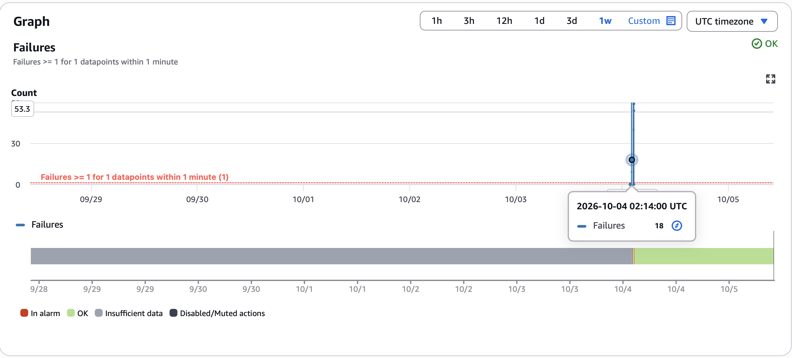
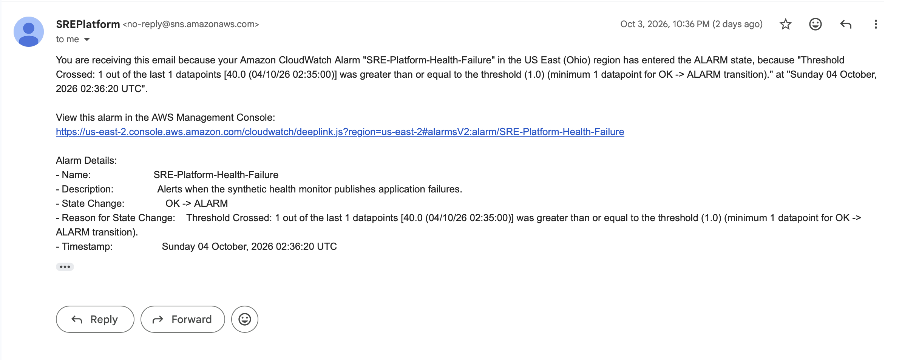

# Site Reliability Platform

A hands-on site reliability engineering project focused on deploying, monitoring, testing, and recovering a web service on AWS.

The application itself is intentionally minimal. The focus is the reliability layer around it: Linux service management, reverse proxying, synthetic monitoring, observability, alerting, failure testing, and recovery.

## Architecture

```text
Internet
   |
   v
Nginx :80
   |
   v
Uvicorn 127.0.0.1:8000
   |
   v
FastAPI /health
```

Monitoring and alerting:

```text
Python synthetic monitor
   |
   v
CloudWatch custom metrics
   |
   v
CloudWatch alarm
   |
   v
Amazon SNS
   |
   v
Email notification
```

External monitoring (verified for the success path only; see [Datadog External Monitoring](#datadog-external-monitoring)):

```text
Datadog Synthetic HTTP test (AWS Ohio location, every 15 minutes)
   |
   v
Public endpoint on the EC2 instance: GET /health
```

The service runs on an Ubuntu EC2 instance. Uvicorn is bound to localhost, while Nginx provides the public HTTP entry point on port 80.

## What Runs Where

**Deployed on AWS (the EC2 instance and AWS services)**

- FastAPI service under Uvicorn and systemd, behind Nginx on port 80
- Python synthetic monitor
- CloudWatch custom metrics, dashboard, and alarm; SNS email notification; EC2 IAM role

This deployment was built and configured by hand. It is **not** provisioned or configured by Terraform, Ansible, or Jenkins.

**External service**

- A Datadog Synthetic HTTP test that probes the EC2 endpoint from outside AWS. It is configured in the Datadog UI.

**Local demonstrations (not deployed to AWS)**

- **Docker:** the FastAPI service runs in a container on a local machine.
- **Jenkins:** a CI pipeline runs on a local Jenkins and deploys only a temporary local container.
- **Ansible:** a playbook configures Nginx in a throwaway local Ubuntu container, not on EC2.
- **Terraform:** a small demo created, verified, and destroyed one isolated security group. It does not manage the EC2 instance.

## Technologies

AWS deployment:

- Python
- FastAPI
- Uvicorn
- Linux / Ubuntu
- systemd
- Nginx
- AWS EC2
- Amazon CloudWatch
- Amazon SNS
- boto3
- Git / GitHub

Local demonstrations:

- Docker
- Jenkins LTS (with a Docker-in-Docker sidecar)
- Terraform
- Ansible

External monitoring:

- Datadog Synthetic Monitoring

## Service

`service/main.py` exposes a deliberately simple health endpoint:

```text
GET /health
```

Healthy response:

```json
{"status":"healthy"}
```

Keeping the application small makes the reliability behavior easy to observe and test.

## Process Management

Uvicorn runs as a systemd-managed service using `deploy/sre-service.service`.

The service:

- runs as the Ubuntu user
- uses the project's Python virtual environment
- binds Uvicorn to `127.0.0.1:8000`
- starts automatically during normal system boot
- is configured with `Restart=on-failure`

Uvicorn is not directly exposed to the internet.

## Nginx Reverse Proxy

Nginx provides the public HTTP entry point:

```text
Client -> Nginx :80 -> Uvicorn 127.0.0.1:8000 -> FastAPI
```

Requests received by Nginx are forwarded to the application server over localhost.

## Synthetic Monitoring

`monitor/monitor.py` continuously checks the health endpoint.

The monitor:

- performs HTTP health checks
- measures response duration
- records structured JSON events
- tracks consecutive failures
- retries failed checks
- alerts after three consecutive failures
- limits repeated alerts with a cooldown
- detects recovery and resets the failure counter

## CloudWatch Observability

When CloudWatch publishing is enabled, the monitor publishes three custom metrics to the `SREPlatform` namespace:

- `Availability`
- `LatencyMs`
- `Failures`

The EC2 instance uses an IAM role for AWS access rather than hard-coded AWS credentials.

A CloudWatch dashboard provides centralized visibility into these metrics.

## Alerting

A CloudWatch alarm monitors the failure metric.

The alert path is:

```text
Synthetic monitor
      |
      v
CloudWatch Failures metric
      |
      v
CloudWatch alarm
      |
      v
Amazon SNS
      |
      v
Email notification
```

This path was tested end-to-end during a controlled application outage.

## Automatic Process Recovery Test

Process-level recovery was tested separately from the controlled outage test.

The Uvicorn process was forcibly terminated with SIGKILL to simulate an unexpected process crash. Because `sre-service` is configured with `Restart=on-failure`, systemd detected the failed process and automatically started a replacement process after the configured restart delay.

After the restart:

- `sre-service` returned to the active state
- Uvicorn was running again
- `/health` returned HTTP 200

This test demonstrates automatic process recovery. It is separate from the controlled outage test below, where `systemctl stop` intentionally keeps the service stopped until manual restoration.

Boot persistence was also verified separately by restarting the EC2 instance and confirming that the enabled systemd service started during normal boot and `/health` returned HTTP 200.
## Controlled Failure Test

The deployed system was tested by deliberately creating an application outage.

### Healthy State

Before failure injection:

- `sre-service` was active
- Nginx successfully proxied `/health`
- the endpoint returned HTTP 200
- the monitor reported successful checks
- healthy metrics were published to CloudWatch

### Failure Injection

The application service was intentionally stopped:

```bash
sudo systemctl stop sre-service
```

During the outage:

- the health endpoint became unavailable
- the monitor detected failed checks
- the consecutive failure count increased
- the local threshold alert fired after three consecutive failures
- failure metrics were published to CloudWatch
- the CloudWatch alarm entered its alarm state
- SNS delivered the alarm email

### Recovery

The service was restored:

```bash
sudo systemctl start sre-service
```

After restoration:

- systemd reported the service active
- `/health` returned HTTP 200 through Nginx
- the monitor detected recovery
- the consecutive failure count reset to zero
- healthy CloudWatch measurements resumed

### Test Evidence

The controlled outage produced a sustained failure signal in CloudWatch, triggered the configured failure alarm, and delivered an SNS email notification.

#### CloudWatch failure alarm



#### SNS alarm notification



Detailed failure-test notes are available in `incidents/failure-tests.md`.

## Docker

*Local demonstration. Not used for the EC2 deployment, which runs under systemd.*

`Dockerfile` builds an image of the FastAPI service: `python:3.12-slim`, a non-root user, only `service/` and
`requirements.txt` copied in, Uvicorn on `0.0.0.0:8000`, and a Python `urllib` `HEALTHCHECK` against `/health`.
`.dockerignore` keeps `.git`, virtual environments, `.env` files, keys, logs, and Terraform state out of the build.

Verified locally: the image built, the container's health status became `healthy`, the container ran as a
non-root user, and `GET /health` returned HTTP 200 with `{"status":"healthy"}`. The image is not pushed to any registry.

## Jenkins CI

*Local demonstration. Jenkins does not deploy to AWS.*

`Jenkinsfile` and `jenkins/` run Jenkins LTS in Docker, bound to `127.0.0.1:8080`, with a TLS Docker-in-Docker
sidecar so no host Docker socket is mounted. The pipeline checks out the committed branch from the local Git
repository and runs seven stages: Checkout, Install Dependencies, Test (the 4 unit tests), Build Image (the
existing `Dockerfile`), Deploy Temporary Container (a local container on an isolated port), Verify Health
(`GET /health` must return HTTP 200), and cleanup.

**Build #2: SUCCESS.** All stages ran, the health check returned HTTP 200, and the temporary container and image were removed.

Limits: the pipeline never touches AWS or the EC2 instance, pushes to no registry, uses no credentials, and is
not triggered by GitHub. It relies on a lab-only Jenkins setting (`ALLOW_LOCAL_CHECKOUT`) that must not be used
on a shared Jenkins. See `jenkins/README.md`.

## Terraform

*Small demonstration. Terraform does not manage the EC2 instance.*

`terraform/demo/` defines one resource: an isolated security group named `sre-terraform-demo` in an existing
VPC in `us-east-2`, with no inbound or outbound rules and nothing attached to it.

It was planned and applied once (1 resource added), verified with the AWS CLI (name, VPC, tags, and zero rules),
checked for drift (no differences), and later destroyed. After the destroy, `terraform state list` was empty
and AWS returned `InvalidGroup.NotFound` for the group. The existing EC2 instance, security groups,
Nginx, systemd, CloudWatch, and SNS were not managed, imported, or modified. State is local and not committed.
See `terraform/demo/README.md`.

## Ansible

*Local demonstration. The playbook does not configure the EC2 instance.*

`ansible/` contains an inventory, a playbook, and a template that install and configure Nginx on a throwaway,
unprivileged Ubuntu 24.04 container, reached with `docker exec` and published only on `127.0.0.1:18080`.

Verified: the first run reported `changed=4`, the second run reported `changed=0`, `nginx -t` passed, and the
endpoint returned HTTP 200. It uses its own demo Nginx config and does not touch `deploy/nginx.conf` or
`deploy/sre-service.service`. See `ansible/README.md`.

## Datadog External Monitoring

*External SaaS check of the AWS deployment, configured in the Datadog UI.*

A Datadog Synthetic HTTP test sends `GET /health` to the EC2 application's public endpoint every 15 minutes
from one AWS Ohio location. Its assertions are status code `200`, response time below 2000 ms, and
`Content-Type: application/json`.

**Verified:** two executions (one scheduled, one manual) both passed, with HTTP 200 and response times of about
7 to 10 ms. The Datadog monitor status is OK.

**Not yet verified:** failure detection, alert notifications, and recovery. The test has only been observed
passing. See `docs/datadog-monitoring.md` for the comparison with the Python monitor and CloudWatch, and for
the full list of limitations.

## Running Locally

Create a virtual environment:

```bash
python3 -m venv .venv
source .venv/bin/activate
```

Install dependencies:

```bash
python -m pip install -r requirements.txt
```

Start the FastAPI service:

```bash
python -m uvicorn service.main:app --host 127.0.0.1 --port 8000
```

Verify the endpoint:

```bash
curl -i http://127.0.0.1:8000/health
```

Run the synthetic monitor:

```bash
python monitor/monitor.py --url http://127.0.0.1:8000/health
```

On the AWS deployment, CloudWatch publishing can be enabled with:

```bash
python monitor/monitor.py --url http://127.0.0.1/health --cloudwatch
```

Run the unit tests:

```bash
python -m unittest discover -s tests -v
```

Build and run the container locally (bound to loopback only):

```bash
docker build -t sre-platform:demo .
docker run -d --name sre-platform-demo -p 127.0.0.1:18000:8000 sre-platform:demo
curl -i http://127.0.0.1:18000/health
docker rm -f sre-platform-demo
```

The Jenkins, Terraform, and Ansible demonstrations have their own instructions in `jenkins/README.md`,
`terraform/demo/README.md`, and `ansible/README.md`.

## Repository Structure

```text
site-reliability-platform/
├── service/
│   └── main.py
├── monitor/
│   └── monitor.py
├── tests/
│   └── test_monitor.py
├── deploy/                  # EC2 deployment files
│   ├── nginx.conf
│   └── sre-service.service
├── Dockerfile               # local container image of the service
├── .dockerignore
├── Jenkinsfile              # local CI pipeline
├── jenkins/                 # local Jenkins + Docker-in-Docker setup
│   ├── Dockerfile
│   ├── docker-compose.yml
│   └── README.md
├── terraform/demo/          # isolated security group demo
│   ├── *.tf
│   ├── .terraform.lock.hcl
│   ├── terraform.tfvars.example
│   └── README.md
├── ansible/                 # Nginx configuration demo on a local container
│   ├── inventory.ini
│   ├── playbook.yml
│   ├── templates/nginx.conf.j2
│   └── README.md
├── incidents/
│   └── failure-tests.md
├── docs/
│   ├── images/
│   ├── project-explained.md
│   └── datadog-monitoring.md
├── requirements.txt
└── README.md
```

## Project Scope

This is intentionally a small learning and portfolio project rather than a production-ready platform.

It demonstrates:

- AWS EC2 deployment
- Linux service management
- Nginx reverse proxying
- synthetic HTTP monitoring
- structured health-check logging
- failure thresholds and local alerting
- custom CloudWatch metrics
- CloudWatch dashboarding
- CloudWatch alarms
- SNS email notification
- controlled failure injection
- service restoration and recovery detection
- local containerization with Docker
- a local Jenkins CI pipeline (tests, image build, temporary container, health check, cleanup)
- infrastructure as code with Terraform, limited to one isolated demo security group
- idempotent configuration management with Ansible on a local container
- an external Datadog synthetic check (success path only)

It does **not** currently:

- deploy anything to AWS through Jenkins
- manage the EC2 instance, its security groups, Nginx, systemd, CloudWatch, or SNS with Terraform
- configure the EC2 instance with Ansible
- provide verified Datadog failure detection, alert notifications, or recovery
- provide TLS, high availability, or centralized log aggregation

Potential improvements include managing the EC2 deployment with infrastructure as code and configuration management, automated deployment to EC2 from CI, tighter least-privilege IAM, TLS, centralized logging, verifying Datadog alerting and recovery, and additional failure scenarios.
